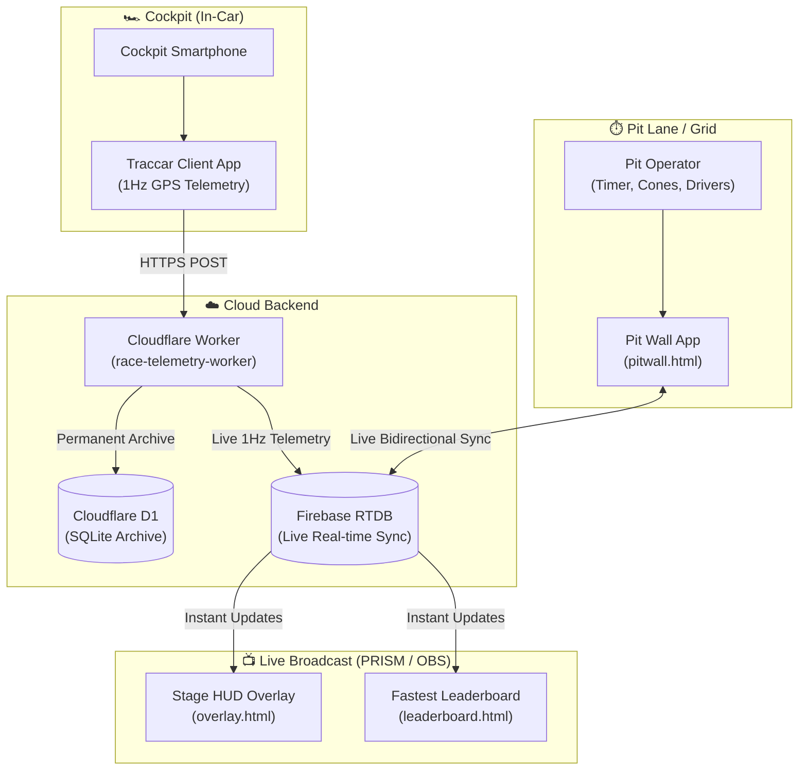

# 🏁 Race Telemetry & Autocross System Setup Guide

This document is the complete end-to-end guide for setting up and operating the live telemetry, pit wall stopwatch, and PRISM Live Studio / OBS stream overlays for race day.

---

## 📑 Quick Navigation
1. [System Architecture](#1-system-architecture)
2. [Apps & Tools to Download](#2-apps--tools-to-download)
3. [All Live URLs Directory](#3-all-live-urls-directory)
4. [Cockpit GPS Setup (Traccar Client)](#4-cockpit-gps-setup-traccar-client)
5. [PRISM Live Studio & OBS Stream Overlays Setup](#5-prism-live-studio--obs-stream-overlays-setup)
6. [Pit Wall Operator Walkthrough](#6-pit-wall-operator-walkthrough)
7. [Pre-Race Sanity Checklist & Troubleshooting](#7-pre-race-sanity-checklist--troubleshooting)

---

## 1. System Architecture



---

## 2. Apps & Tools to Download

### A. For Cockpit / Driver Phone (GPS Tracker)
* **Traccar Client** (Recommended):
  * **iOS (iPhone)**: [Download on Apple App Store](https://apps.apple.com/app/traccar-client/id843156976)
  * **Android**: [Download on Google Play Store](https://play.google.com/store/apps/details?id=org.traccar.client)
  * *Zero-install alternative*: If you do not want to install an app, you can simply open **[gps.html](https://breadcrowns.github.io/race-telemetry/gps.html)** directly in Mobile Safari/Chrome and tap **"Start Tracking"**.

### B. For Streaming PC / Mac or Mobile Broadcast Rig
* **PRISM Live Studio**:
  * **Windows / macOS**: [Download PRISM Live Studio for Desktop](https://prismlivestudio.com/)
  * **iOS / Android**: Search `PRISM Live Studio` in the App Store or Google Play.
* *(Alternative)* **OBS Studio**:
  * **Windows / macOS / Linux**: [Download OBS Studio](https://obsproject.com/)

### C. For Pit Wall Timing & Management (Phone, iPad, or Laptop)
* **No app installation required!**
* Runs in any modern web browser (Google Chrome, Safari, Edge, Firefox).

---

## 3. All Live URLs Directory

> [!NOTE]
> All web pages are hosted via GitHub Pages on the repository: `https://github.com/BreadCrowns/race-telemetry`.

| Web Page | Live URL | Purpose |
| :--- | :--- | :--- |
| **Pit Wall App** | `https://breadcrowns.github.io/race-telemetry/pitwall.html` | Stopwatch, driver selection, cone penalties, notes, leaderboard, and stream monitor. |
| **Stage HUD Overlay** | `https://breadcrowns.github.io/race-telemetry/overlay.html` | PRISM/OBS stream overlay: active driver, run #, live stopwatch, penalties, notes, speed MPH. |
| **Leaderboard Overlay** | `https://breadcrowns.github.io/race-telemetry/leaderboard.html` | PRISM/OBS stream overlay: ranked fastest times (#1 to #4) and deltas. |
| **Cockpit Web GPS** | `https://breadcrowns.github.io/race-telemetry/gps.html` | Zero-install in-car GPS tracker (alternative to Traccar). |
| **Endurance Pit Wall** | `https://breadcrowns.github.io/race-telemetry/pitwall_future.html` | Full endurance racing suite (fuel, stints, lap charts, tire stint logs). |
| **Admin Panel** | `https://breadcrowns.github.io/race-telemetry/admin.html` | Raw database diagnostics and telemetry resets. |
| **Camera HUD** | `https://breadcrowns.github.io/race-telemetry/camera-hud.html` | Fullscreen mobile camera overlay with HUD telemetry. |

---

## 4. Cockpit GPS Setup (Traccar Client)

### Step 1: Open Traccar Client Settings
Open the **Traccar Client** app on the smartphone placed inside the car.

### Step 2: Configure Required Fields

| Setting | Exact Value to Enter | Why It's Critical |
| :--- | :--- | :--- |
| **Device identifier** | `fiero` *(or your car/driver name)* | Used to identify the vehicle in telemetry packets. |
| **Server URL** | `https://race-telemetry-worker.<your-subdomain>.workers.dev` | Your Cloudflare Worker URL. **Must start with `https://`** and **must NOT have `:5055`** at the end. |
| **Location provider** | `Mixed` or `GPS` | Uses the phone's native high-accuracy GPS antenna. |
| **Frequency / Interval** | `1` | Transmits updates every 1 second (essential for 1Hz speed & stopwatch sync). |
| **Distance** | `0` | **CRITICAL!** If set to 50 or 100, the phone will refuse to transmit while stationary in grid. Set to `0`. |
| **Angle** | `0` *(or leave blank)* | Do not filter by cornering angle. |
| **Offline buffering** | `Enabled` | Buffers GPS points in memory if cellular signal drops, then uploads them when signal returns. |

### Step 3: Start the Service
1. Toggle the **Service status** switch to **ON**.
2. Tap the **Status** tab:
   - You should immediately see:
     ```text
     Location accepted
     Location update sent
     ```
   - If you see `Location accepted` without `Location update sent`, verify **Distance is set to 0** and **Frequency is set to 1**.
   - If you see `Send failed`, verify that the Server URL starts with `https://` and has no trailing spaces.

---

## 5. PRISM Live Studio & OBS Stream Overlays Setup

Both stream overlays are designed with **transparent backgrounds**, high-contrast typography, and smooth glassmorphism shadows so they look professional over any racing footage.

```
+-------------------------------------------------------------------+
|  [P1] LIAM  00:48.21 LEADER           STAGE HUD                   |
|  [P2] JEFF  00:48.56  +0.35s    +-------------------------------+ |
|  [P3] RYAN  00:49.10  +0.89s    | JEFF  RUN #1   00:48.56  47MPH| |
|  [P4] MATT  --:--.-- NO TIME    +-------------------------------+ |
|  (Leaderboard Overlay)                       (Stage HUD Overlay)  |
|                                                                   |
|                      [ LIVE CAR VIDEO FEED ]                      |
+-------------------------------------------------------------------+
```

### Overlay 1: Stage HUD (`overlay.html`)
Shows the active driver, run number, real-time stopwatch, cone penalties, notes, live speed in MPH, and GPS connection status.

1. In PRISM Live Studio or OBS Studio, click **`+` (Add Source)** $\to$ select **Browser Source**.
2. Name the source: `Stage HUD`.
3. In the source properties window, enter:
   - **URL**: `https://breadcrowns.github.io/race-telemetry/overlay.html`
   - **Width**: `540`
   - **Height**: `200`
   - **Custom CSS**: Leave blank or set `body { background: transparent; overflow: hidden; }`
   - **Shutdown source when not visible**: Checked.
4. Click **OK** and drag the box to your preferred screen position (top-right or bottom-center recommended).

---

### Overlay 2: Leaderboard (`leaderboard.html`)
Shows the ranked fastest clean run for each driver (#1 to #4) with gaps to the leader (`LEADER`, `+0.35s`, etc.). Automatically ignores DNFs.

1. In PRISM Live Studio or OBS Studio, click **`+` (Add Source)** $\to$ select **Browser Source**.
2. Name the source: `Leaderboard`.
3. In the source properties window, enter:
   - **URL**: `https://breadcrowns.github.io/race-telemetry/leaderboard.html`
   - **Width**: `340`
   - **Height**: `250`
   - **Custom CSS**: Leave blank or set `body { background: transparent; overflow: hidden; }`
   - **Shutdown source when not visible**: Checked.
4. Click **OK** and position it in a screen corner (top-left or bottom-left recommended).

> [!TIP]
> **Dynamic vs Locked Event Sync**:
> By default, `leaderboard.html` automatically detects whatever event title is typed on the pit wall!
> If you ever want to permanently lock the overlay to a specific event, append `?event=Your+Event+Name` to the URL:
> `https://breadcrowns.github.io/race-telemetry/leaderboard.html?event=Sunday+Autocross`

---

## 6. Pit Wall Operator Walkthrough

Open **`https://breadcrowns.github.io/race-telemetry/pitwall.html`** on your smartphone, tablet, or laptop.

```
+-------------------------------------------------------------+
|  EVENT: [ Sunday Autocross ]              ● GPS 100% LIVE   |
|                                                             |
|  DRIVER:  [ JEFF ]   [ LIAM ]   [ RYAN ]   [ MATT ]         |
|  RUN:     [  1  ]                                           |
|                                                             |
|  +-------------------------------------------------------+  |
|  |                    00:48.56                           |  |
|  |             [ ▶ START RUN / STOP ]                    |  |
|  +-------------------------------------------------------+  |
|                                                             |
|  CONES: [ - ] 0 [ + ]       [  ] DNF Flag                   |
|  NOTES: [ Entered slalom with great exit speed           ]  |
|  [ 💾 LOG & SAVE RUN ]                                      |
+-------------------------------------------------------------+
```

### Step 1: Set the Event Name
* Type the event name into the **Event Name** text box at the top (e.g. `Sunday Autocross`).
* **Multi-device sync**: Any device that types the same event name will instantly load the run history and leaderboard from Firebase!

### Step 2: Select Driver & Run Number
* Quick-tap the driver getting into the car: **Jeff**, **Liam**, **Ryan**, or **Matt**.
* The **Run Number** auto-increments based on that driver's previous runs, or you can manually edit it.

### Step 3: Run the Stopwatch
1. When the driver is staged: the stream overlay shows **`READY`** in cyan.
2. When the car launches: Tap **`START RUN`**. The large timer turns bright green and starts counting up.
3. When the car crosses the finish timing line: Tap **`FINISH RUN`**. The timer stops and freezes the time.

### Step 4: Record Penalties & Notes
* **Cones Hit**: Use the `[-]` and `[+]` buttons to enter the number of knocked-over cones (+2.000 seconds each).
* **DNF Flag**: Check the `DNF` box if the driver went off course or did not complete the run.
* **Notes**: Optionally type any setup notes (e.g., `"Tire pressure 32psi front"`).

### Step 5: Log Run
* Tap **`💾 LOG RUN`**.
* The run is permanently saved to Firebase, the **Leaderboard** overlay recalculates rankings instantly, and the form resets for the next run.

### Step 6: Monitor the Broadcast Overlays
* Scroll down to the **📺 Live Stream Overlay Monitor** card.
* Tap **`[Stage HUD]`** or **`[Leaderboard]`** to see an exact, scaled-down replica of what the stream audience is viewing.
* Mobile scaling is fully automatic: the preview scales down to fit any smartphone without cutting off the speedometer or penalties.
* Tap **`[↗ Pop Out]`** if you want to open the overlay in its own fullscreen tab.

---

## 7. Pre-Race Sanity Checklist & Troubleshooting

### 5-Minute Pre-Race Checklist
- [ ] **Cockpit Phone Mounted & Plugged into Charger** in the car.
- [ ] **Traccar Client Started**: Status displays `Location accepted` and `Location update sent`.
- [ ] **Pit Wall Heartbeat**: On `pitwall.html`, the GPS dot is **bright green** (`LIVE`).
- [ ] **Stream Overlays Visible**: PRISM / OBS shows the HUD with current driver name and speed `0 MPH`.
- [ ] **Test Stopwatch Pulse**: Tap `START RUN` $\to$ verify the stream overlay changes to `RUNNING` $\to$ tap `FINISH RUN` $\to$ reset.

---

### Troubleshooting Matrix

| Issue | Root Cause | Instant Fix |
| :--- | :--- | :--- |
| **GPS Heartbeat is Yellow or Red** | Traccar Client not transmitting or cellular data lost. | 1. Open Traccar Client $\to$ verify **Service status** is ON.<br>2. Verify **Distance is `0`**.<br>3. Verify **Frequency is `1`**.<br>4. Verify cockpit phone has cellular data enabled. |
| **Traccar shows `Send failed`** | Server URL format error. | 1. Ensure URL starts with `https://` (not `http://`).<br>2. Remove `:5055` if present.<br>3. Ensure no trailing spaces or typo in the URL. |
| **Overlay in PRISM / OBS shows blank** | Browser source URL error or cache. | 1. Double check the URL: `https://breadcrowns.github.io/race-telemetry/overlay.html`.<br>2. In PRISM source properties, click **"Refresh cache of current page"**. |
| **Overlay preview on phone cuts off** | Cached CSS file on phone. | Hard refresh the pitwall page (`Ctrl+F5` or clear Safari mobile cache). The latest version includes responsive GPU scaler support. |
| **Run history didn't transfer to second device** | Different Event Name entered. | Ensure the **Event Name** text box on both devices is spelled identically (e.g. `Sunday Autocross`). Firebase organizes history under matching event keys. |
| **Fastest run shows cone penalty** | Valid behavior under autocross rules. | A run with cone penalties (+2s) can still be fastest if raw time was exceptionally fast. It displays `⭐ FASTEST (+2s)` with warning styling. |

---

*Race telemetry and autocross suite built for Sunday Autocross.*
