# 🏁 Race Telemetry & Autocross System Setup Guide

This document is the complete end-to-end guide for race day. It details how the **single smartphone mounted in the car** streams live video to **YouTube via PRISM Live Studio** using a **YouTube stream key**, embeds the **Stage HUD overlay**, and transmits background **1Hz GPS telemetry via Traccar Client**, while the **pit crew controls the stopwatch and driver queue from the pit wall**.

---

## 📑 Quick Navigation
1. [System Architecture (Single In-Car Phone + Pit Wall)](#1-system-architecture)
2. [Hardware & Apps Required](#2-hardware--apps-required)
3. [All Live URLs Directory](#3-all-live-urls-directory)
4. [Step 1: YouTube Live Stream Key Setup](#4-step-1-youtube-live-stream-key-setup)
5. [Step 2: PRISM Live Studio Mobile Setup (In-Car Phone)](#5-step-2-prism-live-studio-mobile-setup-in-car-phone)
6. [Step 3: Traccar Client Background GPS Setup (In-Car Phone)](#6-step-3-traccar-client-background-gps-setup-in-car-phone)
7. [Step 4: Pit Wall Operator Walkthrough (Pit Crew Device)](#7-step-4-pit-wall-operator-walkthrough-pit-crew-device)
8. [Pre-Race Sanity Checklist & Troubleshooting Matrix](#8-pre-race-sanity-checklist--troubleshooting-matrix)

---

## 1. System Architecture

```mermaid
flowchart TD
    subgraph Cockpit ["🏎️ Cockpit Phone (Mounted in Car)"]
        Cam["Phone Camera\n(Out Windshield / Driver)"]
        Prism["PRISM Live Studio (Mobile App)\n• Live H.264 Encoder\n• Web Overlay Widget: overlay.html"]
        Traccar["Traccar Client (Background Service)\n• 1Hz GPS Speed & Coordinates"]
        
        Cam --> Prism
    end

    subgraph Cloud ["☁️ Cloud & Broadcast Infrastructure"]
        YT["🔴 YouTube Live Stream\n(Viewers Watch Live On YouTube)"]
        CF["Cloudflare Worker\n(race-telemetry-worker)"]
        Firebase[("Firebase Realtime DB\n(Live Sync: Stopwatch, Driver, GPS)")]
        
        Prism -->|RTMP Video + Stream Key| YT
        Traccar -->|HTTPS 1Hz GPS| CF
        CF -->|Live Speed & Diagnostics| Firebase
    end

    subgraph Pitwall ["⏱️ Pit Crew Device (Phone / iPad / Laptop in Grid)"]
        Pit["Pit Wall App\n(pitwall.html)"]
        Operator["Pit Operator\n• Select Driver (Jeff, Liam, Ryan, Matt)\n• Tap START RUN / FINISH RUN\n• Log Cone Penalties (+2s) & DNF\n• Notes"]
        Operator --> Pit
        Pit <-->|Instant Bidirectional Sync| Firebase
    end

    Firebase -.->|Live Stopwatch, Driver & Speed Updates| Prism
```



---

## 2. Hardware & Apps Required

### Device 1: Cockpit Smartphone (Inside the Car)
* **Mount**: Sturdy windshield or dashboard phone mount with a clear view of the track.
* **Power**: Connected to a 12V cigarette-lighter USB fast charger (vital to keep phone charged while streaming video).
* **Apps to Install on this Phone**:
  1. **PRISM Live Studio (Mobile)**:
     - [iOS App Store](https://apps.apple.com/app/prism-live-studio/id1319056339)
     - [Android Google Play Store](https://play.google.com/store/apps/details?id=com.prism.live)
  2. **Traccar Client**:
     - [iOS App Store](https://apps.apple.com/app/traccar-client/id843156976)
     - [Android Google Play Store](https://play.google.com/store/apps/details?id=org.traccar.client)

---

### Device 2: Pit Wall Device (In the Paddock / Staging Grid)
* **Device**: Any smartphone (iPhone/Android), tablet (iPad), or laptop.
* **App**: **No app download required!** Runs directly in Safari, Chrome, or Edge.

---

## 3. All Live URLs Directory

> [!NOTE]
> All pages are hosted via GitHub Pages on repository: `https://github.com/BreadCrowns/race-telemetry`.

| Web Page | Live URL | Purpose |
| :--- | :--- | :--- |
| **Combined Embed Dashboard** | `https://breadcrowns.github.io/race-telemetry/embed.html` | **Google Sites / Web Embed**: Both Stage HUD & Leaderboard together in a responsive layout. |
| **Stage HUD Overlay** | `https://breadcrowns.github.io/race-telemetry/overlay.html` | **PRISM Mobile / OBS / Embed**: Displays driver, run #, live stopwatch, penalties, notes, speed MPH. |
| **Leaderboard Overlay** | `https://breadcrowns.github.io/race-telemetry/leaderboard.html` | **PRISM Mobile / OBS / Embed**: Displays ranked fastest clean times (#1 to #4) and gap deltas. |
| **Pit Wall Stopwatch App** | `https://breadcrowns.github.io/race-telemetry/pitwall.html` | **Used on Pit Device**: Stopwatch, driver select, cone stepper, DNF, notes, and broadcast monitor. |
| **Cockpit Web GPS** | `https://breadcrowns.github.io/race-telemetry/gps.html` | Web-based GPS fallback transmitter. |
| **Endurance Pit Wall** | `https://breadcrowns.github.io/race-telemetry/pitwall_future.html` | Full endurance racing suite (stints, fuel, tire logs). |

---

## 4. Step 1: YouTube Live Stream Key Setup

Before heading out to the track, grab your YouTube stream key:

1. On a computer or phone browser, open **[YouTube Studio](https://studio.youtube.com/)**.
2. Click the **Create** button (camera icon with a `+`, top right) $\to$ select **Go Live**.
3. In the left navigation, click the **Stream** icon.
4. Locate the **Stream Settings** box:
   * **Stream URL**: Usually `rtmp://a.rtmp.youtube.com/live2`
   * **Stream Key**: Click **Copy** (e.g. `xxxx-xxxx-xxxx-xxxx-xxxx`).
   * *Tip*: Set **Stream Latency** to **Ultra-low latency** or **Low-latency** so the video has minimal delay.
5. Save or message this Stream Key to the in-car phone.

---

## 5. Step 2: PRISM Live Studio Mobile Setup (In-Car Phone)

The phone in the car uses PRISM Live Studio to film the track and stream to YouTube with the HUD overlay superimposed over the video.

### A. Connect YouTube via Custom RTMP (Stream Key)
1. Open the **PRISM Live Studio** app on the in-car phone.
2. Grant permissions for **Camera**, **Microphone**, and **Storage**.
3. Select **Custom RTMP** (or tap **YouTube** to sign in directly with Google):
   * **Stream URL**: `rtmp://a.rtmp.youtube.com/live2`
   * **Stream Key**: Paste your YouTube Stream Key.
   * **Channel / Title**: e.g., `Sunday Autocross - Live Onboard`
4. Tap **Save**.

### B. Add the Stage HUD Overlay Widget
1. In PRISM Live Studio, swipe left or tap the **My Studio** icon (the yellow/white circular icon).
2. Tap **Widget** $\to$ select **Web** (or **URL**).
3. Paste the Stage HUD URL:
   ```text
   https://breadcrowns.github.io/race-telemetry/overlay.html
   ```
4. Tap **Add / Done**:
   * The HUD card will appear on your camera preview with a transparent background.
   * Position and resize the box (recommended: top-center or top-right of the screen so it does not block the road ahead).
5. *(Optional)* You can also add a second web widget for the Leaderboard:
   ```text
   https://breadcrowns.github.io/race-telemetry/leaderboard.html
   ```

### C. Recommended Video Stream Settings
In PRISM settings (gear icon):
* **Resolution**: `720p` (or `1080p` if 5G cellular signal at the track is strong).
* **Bitrate**: `3000 kbps` - `4000 kbps` (keeps stream stable over mobile cellular data).
* **Frame Rate**: `30 fps` (or `60 fps`).
* **Adaptive Bitrate**: **ON** (prevents stream buffering if cell coverage dips).

---

## 6. Step 3: Traccar Client Background GPS Setup (In-Car Phone)

Traccar Client runs in the background on the **same cockpit phone**, pulling high-precision GPS data from the phone's GPS antenna and pushing it to Cloudflare Worker $\to$ Firebase at 1Hz.

### Configuration Settings
1. Open **Traccar Client**:
2. Tap **Settings** and configure:
   * **Device identifier**: `fiero` *(or your vehicle name)*
   * **Server URL**: `https://race-telemetry-worker.<your-subdomain>.workers.dev`
     > [!WARNING]
     > Must start with **`https://`**. Do **NOT** include `:5055` at the end.
   * **Location provider**: `Mixed` or `GPS`
   * **Frequency / Interval**: `1` (second)
   * **Distance**: `0` *(CRITICAL: must be 0 so it transmits even when idling at the start line)*
   * **Angle**: `0` *(or leave blank)*
   * **Offline buffering**: `Enabled`
3. **Turn Service Status to ON**.
4. Tap the **Status** tab:
   * Confirm it logs:
     ```text
     Location accepted
     Location update sent
     ```
5. Swipe to home screen (do not force-close Traccar; leave it running in the background).
6. Return to **PRISM Live Studio** and hit **Go Live**!

---

## 7. Step 4: Pit Wall Operator Walkthrough (Pit Crew Device)

The person on the pit wall opens **`https://breadcrowns.github.io/race-telemetry/pitwall.html`** on their phone, tablet, or laptop.

```
+-------------------------------------------------------------+
|  EVENT: [ Sunday Autocross ]              ● GPS 100% LIVE   |
|                                                             |
|  DRIVER:  [ JEFF ]   [ LIAM ]   [ RYAN ]   [ MATT ]         |
|  RUN:     [  1  ]                                           |
|                                                             |
|  +-------------------------------------------------------+  |
|  |                    00:48.56                           |  |
|  |             [ ▶ START RUN / STOP ]                    |  |
|  +-------------------------------------------------------+  |
|                                                             |
|  CONES: [ - ] 0 [ + ]       [  ] DNF Flag                   |
|  NOTES: [ Good launch, clean through slalom              ]  |
|  [ 💾 LOG & SAVE RUN ]                                      |
+-------------------------------------------------------------+
```

### Race Operation Flow:
1. **Event Name**: Enter the event title (e.g. `Sunday Autocross`).
   * Multi-device sync: Any device entering the same event title automatically shares the same database and history!
2. **Select Driver**: Tap the driver getting into the car: **Jeff**, **Liam**, **Ryan**, or **Matt**.
   * The in-car PRISM stream HUD immediately changes the driver name on YouTube!
3. **Staged Car**:
   * Overlay shows cyan **`READY`**.
4. **Launch**:
   * As the car accelerates off the line, tap **`START RUN`**.
   * Timer turns vibrant green and counts up on the YouTube live stream in real time.
5. **Finish**:
   * When the car crosses the finish timing line, tap **`FINISH RUN`**.
   * Stopwatch freezes with exact time.
6. **Penalties & Notes**:
   * Increment cones hit (+2.000s per cone) or toggle **DNF**.
   * Add any notes (e.g., `Tire pressure 30psi`).
7. **Save Run**:
   * Tap **`💾 LOG RUN`**.
   * Updates the live standings, resets the stopwatch, and auto-increments the run count for the next run.
8. **Live Stream Monitor**:
   * Tap **`[Stage HUD]`** or **`[Leaderboard]`** in the preview card at the bottom to verify what the stream audience is seeing.

---

## 8. Pre-Race Sanity Checklist & Troubleshooting Matrix

### 5-Minute Staging Grid Checklist
- [ ] In-car phone connected to 12V USB charger in car.
- [ ] Traccar Client started $\to$ status displays `Location update sent`.
- [ ] PRISM Live Studio streaming $\to$ YouTube Live dashboard shows green connection health.
- [ ] In PRISM camera view, Stage HUD shows current driver, `READY`, and `0 MPH`.
- [ ] Pit wall device opened to `pitwall.html` with green GPS status dot.
- [ ] Test timer pulse: Pit wall taps `START RUN` $\to$ in-car video HUD timer turns green and starts counting $\to$ pit wall taps `FINISH RUN` $\to$ reset.

---

### Troubleshooting Matrix

| Issue | Cause | Fix |
| :--- | :--- | :--- |
| **YouTube stream says "No data" / Offline** | Stream Key typo or incorrect RTMP URL. | In PRISM RTMP settings, verify Stream URL is `rtmp://a.rtmp.youtube.com/live2` and re-paste the Stream Key from YouTube Studio. |
| **HUD speed stays at 0 MPH or GPS dot is Red** | Traccar Client paused or filtered. | 1. Ensure Traccar service status is ON.<br>2. Verify **Distance is set to `0`** (if set to 50 or 100, phone will not transmit).<br>3. Verify **Frequency is set to `1`**. |
| **Traccar shows `Send failed`** | URL formatted with `http` or has port. | Change URL to `https://...` without `:5055`. |
| **HUD numbers don't update when pit wall clicks Start** | Different Event Name or network disconnect. | 1. Check pit wall internet connection.<br>2. Make sure the pit wall device didn't accidentally change the event name.<br>3. In PRISM, tap the web widget and click reload. |
| **In-car phone gets warm or battery drains** | Video encoding + GPS uses high power. | 1. Use a 12V cigarette adapter capable of at least 18W–30W (PD or QuickCharge).<br>2. Reduce phone screen brightness inside the car to 30% while streaming. |
| **Stream video stutters or drops frames** | Cellular upload bandwidth fluctuating. | In PRISM settings, enable **Adaptive Bitrate** and set resolution to `720p` at `3000 kbps`. |

---

## 9. Embedding into Google Sites & Public Web Pages

To embed the live telemetry and leaderboard into a **Google Site**, team website, or blog:

### Option A: Combined Live Dashboard (`embed.html`) — Recommended!
Displays **both** the Stage HUD (active car on track) and the Leaderboard (fastest times) in a single responsive widget:
* **Desktop / Wide screens**: Displays side-by-side cleanly.
* **Mobile / Narrow screens**: Stacks vertically with zero clipping.

#### How to embed in Google Sites:
1. In Google Sites editor, click **Insert** $\to$ **Embed** (`<>`).
2. **Method 1 (By URL)**:
   - Select the **By URL** tab.
   - Paste: `https://breadcrowns.github.io/race-telemetry/embed.html`
   - Click **Insert**.
   - Drag the blue corner handles on Google Sites to expand the block (recommended height: `380px` - `450px`).
3. **Method 2 (Embed Code — cleanest scaling)**:
   - Select the **Embed code** tab.
   - Paste this snippet:
     ```html
     <iframe src="https://breadcrowns.github.io/race-telemetry/embed.html" 
             style="width: 100%; height: 420px; border: none; overflow: hidden;" 
             scrolling="no">
     </iframe>
     ```
   - Click **Next** $\to$ **Insert**.

---

### Option B: Embedding Stage HUD Only (`overlay.html`)
If you only want the active driver, run number, live stopwatch, and speedometer:
* **Embed Code**:
  ```html
  <iframe src="https://breadcrowns.github.io/race-telemetry/overlay.html" 
          style="width: 100%; height: 230px; border: none; overflow: hidden;" 
          scrolling="no">
  </iframe>
  ```

---

### Option C: Embedding Leaderboard Only (`leaderboard.html`)
If you only want the ranked fastest times:
* **Embed Code**:
  ```html
  <iframe src="https://breadcrowns.github.io/race-telemetry/leaderboard.html" 
          style="width: 100%; height: 280px; border: none; overflow: hidden;" 
          scrolling="no">
  </iframe>
  ```

---

*Race telemetry and autocross suite built for Sunday Autocross.*
